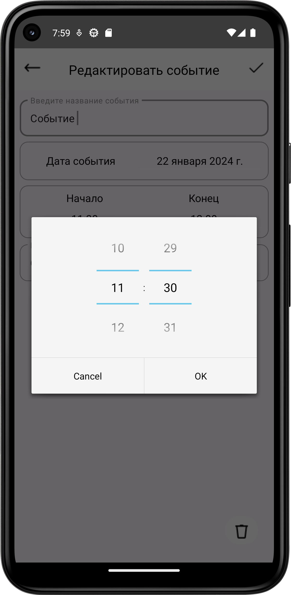

# Тестовое задание на Mobile-практикум Silicium от SimbirSoft
## _Описание_
Мобильное приложение представляет из себя ежедневник, в котором присутствует список дел с календарём, реализована возможность создания нового события, а так же детальная информация о созданном событии которую при необходимости можно отредактировать.

## _Функционал приложения_
Если созданных событий нет, список дел представляет из себя таблицу пустых ячеек с промежутками времени, когда пользователь создает событие оно добавляется в базу данных Room, происходит фильтрация ячеек и пустая ячейка заменяется ячейкой с созданным событием в соответствии с датой и временным промежутком.

При нажатии на день в календаре таблица обновляется и отображает события в соответствии с выбранной датой.

По нажатию на созданное событие переходим на экран детальной информации, в котором есть возможность изменить название события, описание, выбрать дату и временной промежуток. После подтверждения редактирования, обновляется информация о событии в базе данных и таблице в соответствии с новыми данными.

## _Дополнительная информация_
Выставлены ограничения на временные промежутки так, чтобы пользователь создавал события в промежутке одного часа и чтобы время окончания события не было меньше чем время его начала.
По хорошему необходимо делать кастомные вью, чтобы не ограничивать функционал приложения. Сделал так как успел, исходя из времени.

## Sreenshots

